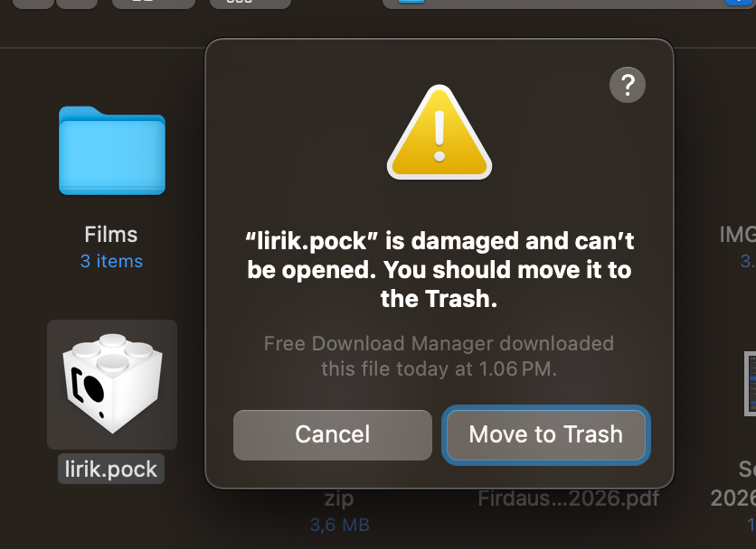
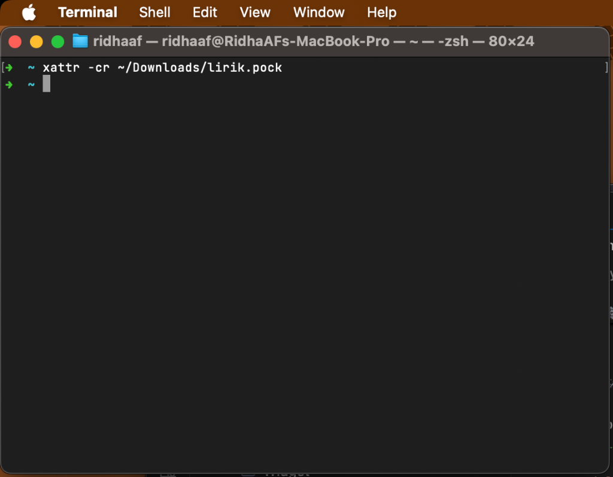
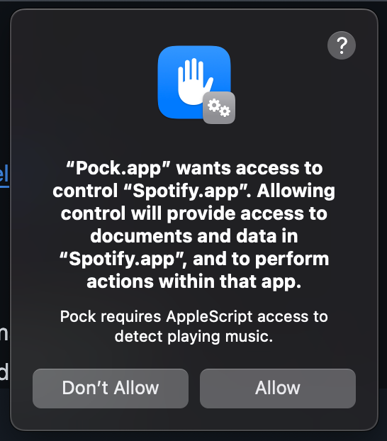

# 🎵 Lirik — Touch Bar Synced Lyrics for macOS (v1.3.1)

**Lirik** is a macOS Touch Bar widget that displays real-time synchronized lyrics for whatever song is playing — **Spotify**, **Apple Music**, or (with this NetEase patch) **网易云音乐 / any macOS Now Playing source**. Built as a native plugin for **Pock**.


---

## ⚡ Features

- **Real-Time Karaoke Lyrics**: Synchronized line-by-line lyrics powered by LRCLIB API with binary-search sync engine.
- **Smart Track Sanitization**: Automatically cleans track titles (strips `(Remastered)`, `[feat.]`, `- Live`) for **30%+ higher lyric match rates**.
- **Tap-to-Copy Touch Bar Gesture**: Tap any active lyric on your Touch Bar to instantly copy the text to your macOS clipboard.
- **Auto-Advancing Plain-Text Fallback**: Progressively steps through static lyrics if time-synced LRC lyrics are unavailable.
- **Album Artwork Thumbnail**: Displays album cover art alongside lyrics on the Touch Bar.
- **Song Title & Artist Display**: Shows song title and artist name (with featuring info) when a track changes, karaoke-style.
- **Customizable Preferences**:
  - **Display Mode**: Choose between **2-Line Karaoke** or **1-Line Compact** mode.
  - **Text Alignment**: **Left Aligned** or **Center Aligned**.
  - **Lyric Text Size**: Small, Medium, or Large.
  - **8 Highlight Color Themes**: White, Gold, Cyan, Green, Purple, Pink, Orange, and Red.
  - **Marquee Scrolling Toggle**: Enable/disable smooth horizontal marquee scrolling for long lyric lines.
  - **Music Player Source**: Auto-detect, **System Now Playing** (网易云 / any Now Playing app), Spotify Only, or Apple Music Only.
  - **Pause Indicator**: Toggle `⏸` icon display when paused.
  - **Album Artwork**: Toggle album artwork thumbnail and choose size (Small, Medium, Large).
  - **Song Title & Artist**: Toggle song title & artist display when track changes.
  - **Clear Cache Button**: Purge local disk cache with one click.
- **Zero Backend**: 100% client-side, lightweight, and fast.

---

## 📥 How to Install

### Prerequisites

1. Ensure you have **Pock** installed on your Mac:
   👉 **Download Pock**: [https://pock.app](https://pock.app)

---

### Step-by-Step Installation Guide

#### 1. Download the Widget
- Download the latest **`lirik.zip`** from [GitHub Releases](https://github.com/RidhaAF/lirik/releases).

#### 2. Clear macOS Quarantine (Crucial)
To prevent macOS Gatekeeper from showing **"lirik.pock is damaged and can't be opened"** or Pock's **`error.invalid-bundle`**:



Run this single command in **Terminal** before opening the widget:
```bash
xattr -cr ~/Downloads/lirik.pock
```



#### 3. Install into Pock
- **Double-click `lirik.pock`** to install automatically in Pock.
- *(Alternative Manual Copy)*: Move `lirik.pock` directly into your Widgets folder:
  ```bash
  cp -R ~/Downloads/lirik.pock ~/Library/Application\ Support/Pock/Widgets/
  ```

#### 4. Enable Lirik on your Touch Bar
1. Click the **Pock** icon in your macOS menu bar.
2. Select **Manage widgets...** (or **Preferences...**).
3. Ensure **Lirik** is enabled (green indicator dot).
4. Click **Customize Pock...** to drag **Lirik** onto your physical Touch Bar layout.

---

### 🔑 First-Time Permission Setup (macOS 15+)

When playing music for the first time:

1. Open **Spotify** or **Apple Music** and start playing a track.
2. macOS will present a system authorization popup:

   

   Click **Allow**.
3. If the popup does not appear or permission was previously denied:
   - Go to **System Settings** $\rightarrow$ **Privacy & Security** $\rightarrow$ **Automation**.
   - Find **Pock** and toggle **Spotify** (and **Music**) to **ON**.
   - Or run this command in **Terminal** to reset system permission prompts, then quit and reopen **Pock** and **Spotify** / **Apple Music**:
     ```bash
     tccutil reset AppleEvents
     ```

---

## 🎵 NetEase Cloud Music (网易云) / System Now Playing

Official 网易云 has **no usable AppleScript dictionary**, so this fork reads **macOS System Now Playing** via [mediaremote-adapter](https://github.com/ungive/mediaremote-adapter) / [media-control](https://github.com/ungive/media-control) (same approach as TouchBarLyrics), then keeps using **LRCLIB** for lyrics.

### Runtime dependency (recommended)

On your Mac (Apple Silicon):

```bash
brew install media-control
# or: brew tap ungive/media-control && brew install media-control
media-control get   # should show title/artist while 网易云 is playing
```

Then in Pock → Manage widgets → **Lirik** → **Music Player Source**:
- **Auto-detect** — System Now Playing first (covers 网易云), AppleScript fallback for Spotify/Music
- **System Now Playing (网易云/any)** — force system path only (no Automation needed for NetEase)

> **Important:** 网易云 must publish Now Playing to macOS (Control Center shows the track). If Control Center shows nothing, Lirik cannot see it either.

Optional self-contained build: place an **arm64/universal** `MediaRemoteAdapter.framework` under `vendor/` (see `BUILD-NETEASE.md`). Do **not** use an x86_64-only framework on Apple Silicon.

Full build/install/test steps: **[BUILD-NETEASE.md](BUILD-NETEASE.md)** · change list: **[CHANGES-NETEASE.md](CHANGES-NETEASE.md)**

---

## ⚙️ Customizing Preferences

You can customize Lirik's layout, colors, alignment, and font size directly inside Pock:

1. Click the **Pock** icon in your macOS menu bar $\rightarrow$ **Manage widgets...**
2. Select **Lirik** in the left sidebar.
3. Configure your preferred settings:
   - **Display Mode**: Select *2-Line Karaoke* or *1-Line Compact*.
   - **Text Alignment**: Select *Left Aligned* or *Center Aligned*.
   - **Text Size**: Choose *Small*, *Medium*, or *Large*.
   - **Highlight Color**: Choose from 8 themes (*White, Gold, Cyan, Green, Purple, Pink, Orange, Red*).
   - **Marquee Scrolling**: Toggle smooth scrolling for long lines.
   - **Player Source**: Select *Auto-detect*, *System Now Playing*, *Spotify*, or *Apple Music*.
   - **Pause Indicator**: Toggle `⏸` icon when paused.
   - **Album Artwork**: Toggle album artwork thumbnail and choose size.
   - **Song Title & Artist**: Toggle song title & artist display on track change.
   - **Clear Cache**: One-click button to purge local lyrics cache.

---

## 🛠 Building from Source

```bash
# Clone the repository
git clone https://github.com/RidhaAF/lirik.git
cd lirik

# Install dependencies via CocoaPods
pod install

# Build release bundle
xcodebuild -workspace lirik.xcworkspace -scheme lirik -configuration Release build ENABLE_USER_SCRIPT_SANDBOXING=NO
```

The output bundle `lirik.pock` will be located in `dist/lirik.pock`.

---

## 👥 Contributors

- [@RidhaAF](https://github.com/RidhaAF) — Creator & Maintainer
- [@rizkifdh](https://github.com/rizkifdh) — Permission fix, album artwork, song title & artist display
- [@yasiramri](https://github.com/yasiramri) — Lyrics sync freeze fix (elapsed-time interpolation, wake refresh), macOS 11+ compatibility

---

## 📄 License

[MIT License](LICENSE) © Ridha Ahmad Firdaus
